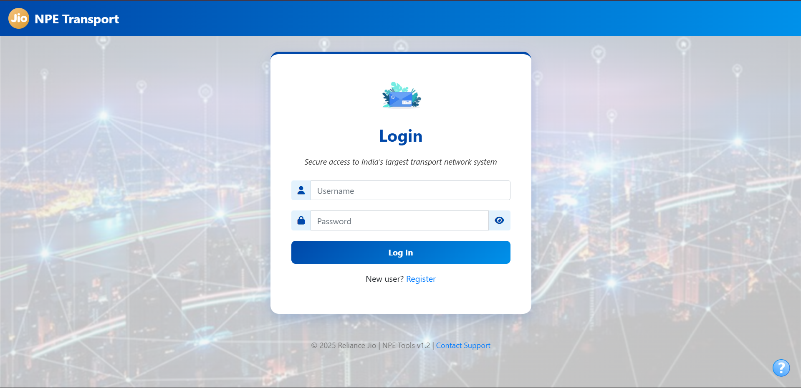
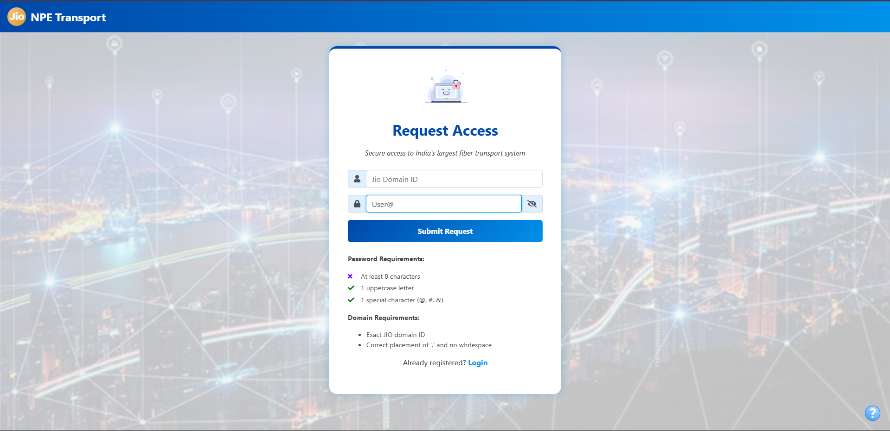
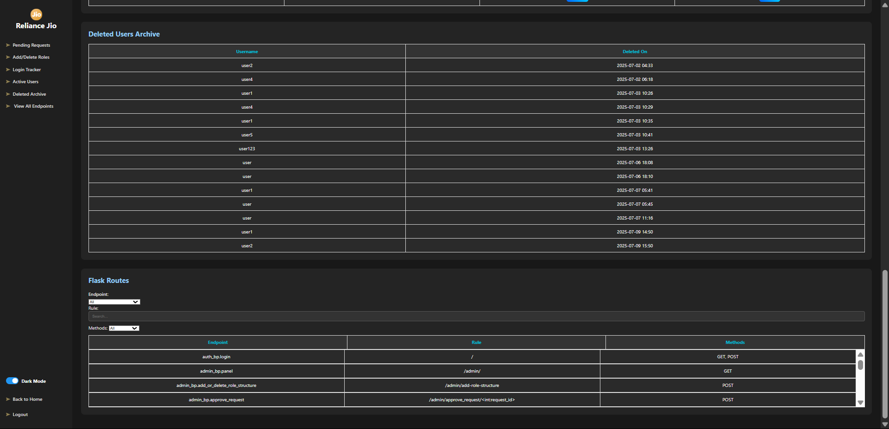

# Flask-Based AAA System Demo

A modular, scalable Flask-based Authentication, Authorization, and Accounting (AAA) system with dynamic session-driven permissions and hierarchical role management.

---

## Features

- Provides secure login and registration pages.
- Enables dynamic approval/rejection of users by Admins.
- Stores user access rights across multiple nested roles.
- Admin panel includes UI to add/remove roles dynamically, without backend edits.
- Added features: password hashing, domain verification, session logout, JS alerts, feedback prompts, and notifications.

---

## Setup Instructions

1. **Clone the repo and navigate:**
   ```bash
   git clone <url>
   cd demo
   ```

2. **Create a virtual environment and activate it:**
   ```bash
   python -m venv venv
   source venv/bin/activate  # On Windows: venv\Scripts\activate
   ```

3. **Install dependencies:**
   ```bash
   pip install -r requirements.txt
   ```

4. **Setup the database:**

   - Update `SQLALCHEMY_DATABASE_URI` in `main.py` or a `.env` file: ENTER RELEVANT DATABASE NAME, PORT NAME AND PASSWORD DETAILS.
   - Then run:
     ```bash
     flask db init
     flask db migrate
     flask db upgrade
     ```

5. **👤 One-Time Admin Creation (via Flask Shell):**

   - Start Flask shell:
     ```bash
     flask shell
     ```

   - Inside the shell, run:
     ```python
     from app import db
     from models import User
     from werkzeug.security import generate_password_hash

     admin = User(
         username="admin",
         email="admin@example.com",
         password=generate_password_hash("admin123"),
         is_admin=True,
         status="Approved"
     )

     db.session.add(admin)
     db.session.commit()
     print("✅ Admin user created successfully!")
     ```
6. **Run the server:**
   ```bash
   python flaskapp.py
   ```
---

## 🧰 Tech Stack

- Flask (Blueprints + App Factory)
- Flask-Login, Flask-WTF, Flask-Migrate
- MySQL + SQLAlchemy
- HTML/CSS/JavaScript (with Jinja2 templates)

---

## Visuals

1. Login Page



2. Register Page
   


4. Admin Panel
   
   .png)
   .png)
   .png)
   .png)
   

8. Dashboards

   -  .png)
   -  .png)

---

## 👨‍💻 Author

Developed by **Deeya Mathur**  
Intern @ Jio | BCA Student @ Amity University Mumbai

> ⚠️ **Note:** This is a DEMO project. The complete role files and production logic cannot be shared due to organizational confidentiality and data protection policies.  
This demo serves only to showcase the architecture, flow, and a simplified implementation of the Flask-based AAA system done as an Intenship project for Jio's NPE Team Server. 
